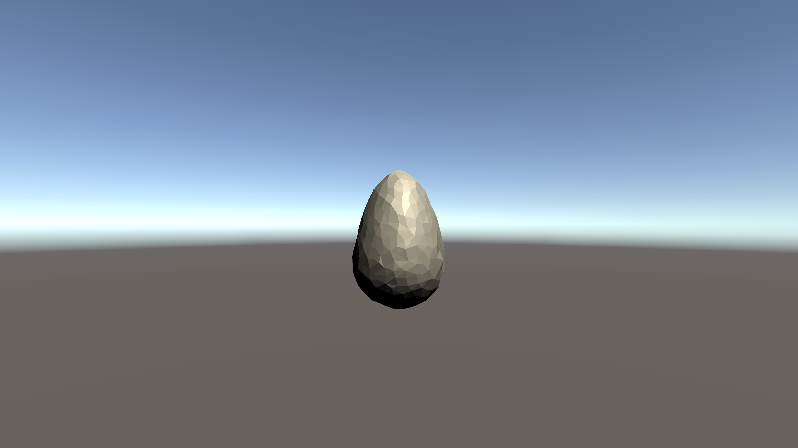

A large element of my project idea will require the user to able to mod the game by supplying their own custom game objects and running custom scripts. To do so I need:

- A way to model objects.
- A scripting language that can be interpreted at runtime.
- The ability to load custom meshes for the objects.
- A way to load all custom files at runtime

### Overall Design

Before I began I created a UML class diagram to plan the prototype. Not much changed in implementation.

### Modelling objects

I chose XML instead of JSON for modelling the custom objects, mainly because XML allows for commenting and I find it more human readable. For the prototype I made a custom "Spawnable" class, which would hold the information for the users custom objects. Heres an example spawnable in XML

`<Spawnable>

​	<spawnableName>Cube</spawnableName>

​	<meshName>cube_mesh.obj</meshName>

​	<onUpdateMethod>cube_onUpdate</onUpdateMethod>

</Spawnable>`

Each spawnable would have the properties:

- **spawnableName** : The name of the object.
- **meshName** : A file name pointing to the custom mesh
- **onUpdateMethod** : The name of a custom method that would be passed the custom object and run on every frame.

These XML objects would then be read in and deserialized by the XmlHelper class.

### Custom Meshes

Custom 3D meshes were simply loaded in based on the spawnables **meshName** property

### Custom Scripts

I chose Lua for custom scripts as it is the most widely used scripting language in game modding. A Lua script  **baseScript.lua** contains all custom **onUpdateMethods**. This file is then loaded in and interpreted using the Moonsharp unity Lua interpretation tool. Each custom object can then run custom scripts defined after runtime.

### Loading All Custom Files

The Lua Scripts, mesh .obj files and object XML files were all placed in the *Streaming Assets* folder in the Unity project and loaded at runtime through various IO operations.

### Example

Heres a basic example of the prototype running:

- I built the app then ran it, resulting in an empty scene.

- I created a quick 3d model of an egg (strange choice, I know). I created an XML data model for an egg spawnable.

  

  I placed egg_mesh.obj in the *Meshes* folder in *Streaming Assets*.

  Now when I ran the game the Egg spawnable was created

  

- I then added the egg's **onUpdateMethod** to the **baseScript.lua** file

  `function egg_onUpdate(gameObject, deltaTime)
  	gameObject.Move(0,0,3 * deltaTime)
  end`

- When I ran the app again the egg moved to the right
  

- I did similar for another Spawnable cube, except made it move left
  

It's not much and will be iterated on, but these objects are completely custom and added after the project build. This will be essential when adding mod support. 

Next I'm going to finalize my project idea using what I've learnt over the last few days, and possibly experiment with a custom event system.
